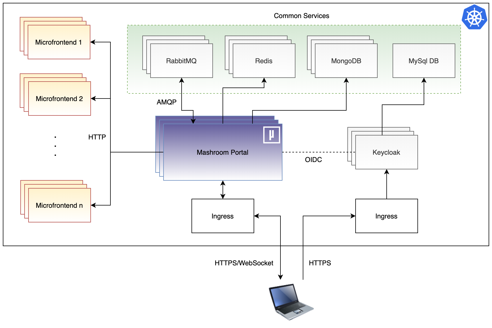

# Creating a Microfrontend Platform with Mashroom Portal on Kubernetes

This document describes a production ready concept for a Microfrontend platform based
on [Mashroom Portal](https://mashroom-server.com) and [Kubernetes](https://kubernetes.io).

The repo contains scripts to setup the complete platform within seconds on [Google Kubernetes Engine](https://cloud.google.com/kubernetes-engine).
But it can of course be deployed on every Kubernetes cluster similarly.

## The platform

### Features

The platform allows it to deploy each Microfrontend separately and to make it **automatically** available in the Portal,
so it can be placed on arbitrary pages.

Highlights:

 * Automatic discovery of newly deployed (Mashroom Portal compliant) Microfrontends
 * High Availability: All building blocks are stateless and can be scaled horizontally
 * Support for server side messaging: The Microfrontends can not only use the *MessageBus* to exchange messages on the same page
   but also with other users and 3rd party systems
 * Extensive metrics exposed in Prometheus format

### Building blocks

The outlined platform consists of:

 * A *Kubernetes* cluster
 * A bunch of common services that can be used by the Portal and the Microfrontends
     * [Keycloak](https://www.keycloak.org) Identity Provider for authentication and authorization
     * [MySQL](https://www.mysql.com/)  database
     * [Redis](https://redis.io) cluster for Portal session storage
     * [RabbitMQ](https://www.rabbitmq.com) as message broker
     * [MongoDB](https://www.mongodb.com) for the Portal configuration
 * A [Mashroom Portal](https://mashroom-server.com) for the Microfrontend integration with the following plugins:
     * @mashroom/mashroom-storage-provider-mongodb
     * @mashroom/mashroom-memory-cache (Memory cache for the MongoDB storage)
     * @mashroom/mashroom-memory-cache-provider-redis
     * @mashroom/mashroom-security-provider-openid-connect
     * @mashroom/mashroom-portal-remote-app-registry-k8s (Microfrontend discovery)
     * @mashroom/mashroom-session-provider-redis
     * @mashroom/mashroom-websocket
     * @mashroom/mashroom-messaging
     * @mashroom/mashroom-messaging-external-provider-amqp
     * @mashroom/mashroom-monitoring-metrics-collector
     * @mashroom/mashroom-monitoring-prometheus-exporter
 * A bunch *Mashroom Portal* compliant of Microfrontends

## Setup Guides

> Note: The setup guides assume you're working in a shell. So all the manual steps and scripts work on
> Linux and macOS, but they also should work with any BASH emulation on Windows.

 * [Setup Guide for Google Cloud Platform](SETUP_GCP.md)
 * [Manual Setup Guide for Kubernetes](SETUP_K8S_MANUAL.md)

 * [Local Development Setup](SETUP_LOCAL_DEV.md)

## Notes

 * **NEVER** use OpenID Connect/OAuth2 without transport layer security in real live systems.
   So, for a production ready setup enable HTTPS for both Portal and Keycloak.
   For GKE follow [the Ingress guide](https://cloud.google.com/kubernetes-engine/docs/concepts/ingress).
 * You should use a CI/CD pipeline to deploy the Portal and the Microfrontends automatically after code changes.
   One way would be to deploy Jenkins on the cluster or to install [Spinnaker](https://www.spinnaker.io/).
   Alternatively use a Cloud service such as [Google Cloud Build](https://github.com/marketplace/google-cloud-build).
 * You should use namespaces to separate common stuff services from your Microfrontends.
 * Some of the resources (like MySQL) or not configured for high availability yet
 * You should also deploy [Prometheus](https://prometheus.io/) and [Grafana](https://grafana.com/) for monitoring the Portal.
   [Here](https://github.com/nonblocking/mashroom/blob/master/packages/plugin-packages/mashroom-monitoring-prometheus-exporter/test/grafana-test/grafana/provisioning/dashboards/Mashroom%20Dashboard.json) you can find an example Dashboard configuration.
