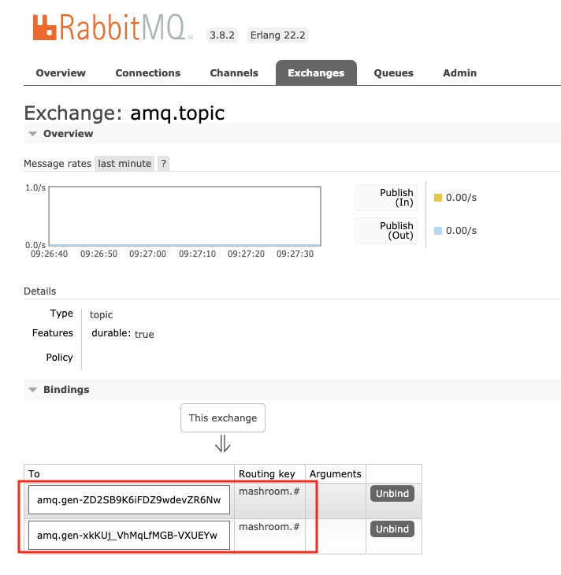

# Manual Setup Guide

This describes how to setup such a platform manually on an arbitrary Kubernetes cluster.

If you use the *Google Kubernetes Engine* use the [GCP Setup Guide](SETUP_GCP.md) which is much simpler.

## Requirements

Locally installed:

 * kubectl (installed and configured)
 * [docker](https://www.docker.com)
 * [helm](https://helm.sh/)

And add at least the following Helm repos:

    helm repo add stable https://kubernetes-charts.storage.googleapis.com/

Cluster:

 * Make sure there is a [Persistent Volume Class](https://kubernetes.io/docs/concepts/storage/persistent-volumes/) available with the access mode *ReadWriteMany*

## Setup the common services

### Redis

    helm install redis --set usePassword=false stable/redis

### RabbitMQ

    helm install rabbitmq-amqp10 \
      --set rabbitmq.username=<username>,rabbitmq.password=<password>,rabbitmq.plugins="rabbitmq_management rabbitmq_peer_discovery_k8s rabbitmq_amqp1_0" \
      stable/rabbitmq

### Create a ConfigMap with the platform services

```yaml
echo "apiVersion: v1
kind: ConfigMap
metadata:
  name: platform-services
  namespace: default
data:
  REDIS_HOST: redis-master.default
  REDIS_PORT: "6379"
  RABBITMQ_HOST: rabbitmq-amqp10.default
  RABBITMQ_PORT: "5672"
  RABBITMQ_USER: <rabbitmq-user>
```

## Deploy the Mashroom Portal

### Create a PVC for the shared data

It requires the access mode *ReadWriteMany*.

```yaml
apiVersion: v1
kind: PersistentVolumeClaim
metadata:
    name: mashroom-data
    namespace: default
spec:
    storageClassName: <your-storage-class>
    accessModes:
        - ReadWriteMany
    resources:
        requests:
            storage: 10Gi
```

### Create a service account

It must have the permission to fetch all services for the namespace with the Microfrontends.

```yaml
apiVersion: v1
kind: ServiceAccount
metadata:
    name: mashroom-portal
    namespace: default
---
apiVersion: rbac.authorization.k8s.io/v1
kind: ClusterRole
metadata:
    name: list-services-cluster-role
rules:
    -   apiGroups:
            - ""
        resources:
            - services
        verbs:
            - get
            - list
---
apiVersion: rbac.authorization.k8s.io/v1
kind: RoleBinding
metadata:
    name: mashroom-portal-role-binding
    namespace: default
subjects:
    -   kind: ServiceAccount
        name: mashroom-portal
roleRef:
    kind: ClusterRole
    name: list-services-cluster-role
    apiGroup: rbac.authorization.k8s.io
```

### Create a docker image

    cd portal
    npm install
    docker build -t <your-registry>/mashroom-portal:latest
    docker push <your-registry>/mashroom-portal:latest

### Deploy on Kubernetes:

You can use

 * portal/kubernetes/mashroom-portal-deployment_template.yaml
 * portal/kubernetes/mashroom-portal-service.yaml
 * portal/kubernetes/mashroom-portal-ingress.yaml

as template and adapt it to your needs. Important is:

 * Don't forget to add the *volumes* declaration and the *volumeMount*
 * Add the *serviceAccountName*

## Deploy the Microfrontends

To deploy microfrontend-demo1 (microfrontend-demo2) can be deployed similar:

### Create a docker image

    cd microfrontend-demo1
    npm install
    npm run build
    docker build -t <your-registry>/microfrontend-demo1:latest
    docker push <your-registry>/microfrontend-demo1:latest

### Deploy on Kubernetes:

You can use

 * portal/microfrontend-demo1/microservice-demo1-deployment_template.yaml
 * portal/microfrontend-demo1/microservice-demo1-service.yaml

as template and adapt it to your needs.

## Check if the platform is up and running

 * Enter http://<ingress-ip> in your browser
 * Login as admin/admin
 * On an arbitrary page click *Add App*, search for *Microfrontend Demo1* and add via Drag'n'Drop:
   
 * You can check the registered Microfrontends on http://<ingress-ip>/portal-remote-app-registry-kubernetes
   
 * To check the messaging add the *Mashroom Portal Demo Remote Messaging App* (as admin) to a page,
   open the same page as another user (john/john) and send as *john* a message to *user/admin/test* -
   it should appear in the other users *Demo Remote Messaging App*
 * You can also check if all portal replicas are subscribed to the message broker. The RabbitMQ Admin UI can
   be made locally available with:

        kubectl port-forward --namespace default svc/rabbitmq-amqp10 15672:15672

   After opening http://localhost:15672 and logging in you should be able to see the bindings on the *amqp.topic* exchange:
   
